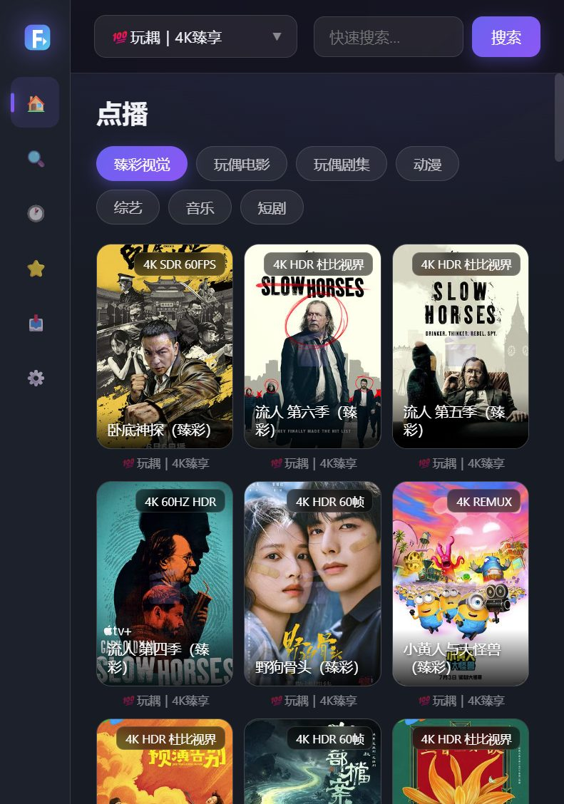

# FlyTV

> Windows 上的本地影视聚合引擎 + Web 前端（TVBox 生态，纯 Java 实现）



FlyTV 把手机上流行的 TVBox / CatVod 生态（jar 爬虫 + 站点配置）搬到 Windows：
本地跑一个 **Java 引擎** + 一个 **jar 爬虫宿主**，浏览器打开 `http://127.0.0.1:9978/web` 即可看片。
全部功能开源、数据本地存储、不依赖任何云端账号。

## 特性

- **点播 / 分类 / 搜索**：任意 TVBox 配置源（XML/JSON），全站流式聚合搜索（边搜边出）
- **搜索体验**：爱奇艺联想（支持拼音 `doupo`、`lldq`）+ 360kan 热榜"搜索发现"
- **网盘播放**：夸克 / UC / 百度登录后可直接播放分享资源
  - 智能转存：同一会话取新 token、按集名自动匹配（分享被上传者换文件也能恢复）
  - 专用 TVBox 目录 + 复用，避免重复转存
- **进度记忆**：播放历史、断点续播、与安卓 TVBox / F 影视 局域网同步（`/action?do=sync`）
- **弹幕**：自动匹配弹幕库，可调字号与显示区域（1/4、半屏、3/4、全屏），按区域自动控制密度
- **强大小工具**：拼音首字母搜索、图片缓存、访问口令、局域网访问、局域网下载发布包
- **零依赖运行**：自带 jlink 精简 JRE 的发布包约 60MB（对比原桌面版 200MB+）

## 架构

```
浏览器 (Web 前端, 纯静态)
   │  HTTP /api/*  (9978)
   ▼
┌───────────────────────────┐
│  FlyTV Java 引擎           │   配置解析 / 站点读写 / 搜索聚合 / 播放编排
│  dev.flytv.engine.*        │   网盘转存(夸克) / 图片代理 / 弹幕 / 口令
└────────────┬──────────────┘
             │  HTTP  (9790)  /load /call /jarpost /jarstream
             ▼
┌───────────────────────────┐
│  jar-host 爬虫宿主          │   dex→class 转换 / Android 兼容桩
│  host.Host + android.*      │   ClassLoader / 标准 TVBox JSON 协议
└────────────┬──────────────┘
             ▼
       TVBox jar 爬虫（运行时由配置源下发）
```

## 目录结构

```
engine/     Java 引擎源码（HttpServer + 业务逻辑）
host/       jar 爬虫宿主源码（含 Android 兼容桩类，可跑手机版 jar 爬虫）
web/        Web 前端（单文件 index.html + Plyr/HLS）
libs/       引擎与宿主共用的第三方依赖 jar（gson/okhttp/jsoup/bcprov 等）
docs/       截图等
```

## 构建

需要 **JDK 11+**（`javac` 在 PATH 中，或安装在常见位置）。

```powershell
# 构建引擎（输出 engine/flytv-engine.jar）
powershell -ExecutionPolicy Bypass -File engine\build.ps1

# 构建 jar 宿主（输出 host/jar-host.jar）
powershell -ExecutionPolicy Bypass -File host\build.ps1
```

## 运行

把构建产物按下面布局放好（发布包即此结构），双击 `启动.cmd` 或执行：

```
FlyTV/
├─ jre/                运行用 JRE（可用 jlink 生成，见下）
├─ libs/               第三方依赖
├─ flytv-engine.jar
├─ jar-host.jar
├─ web/                Web 前端
└─ 启动.cmd
```

```bat
jre\bin\javaw.exe -cp "libs\*;flytv-engine.jar" -Dflytv.port=9978 dev.flytv.engine.Main
```

浏览器打开 `http://127.0.0.1:9978/web`。

<details>
<summary>用 jlink 生成精简 JRE（可选）</summary>

```powershell
jlink --add-modules java.base,java.desktop,java.logging,java.net.http,java.scripting,jdk.crypto.ec,jdk.unsupported,jdk.zipfs `
      --strip-debug --no-header-files --no-man-pages --compress 2 --output jre
```

</details>

## 数据目录

历史 / 收藏 / 设置 / 缓存统一放在（与旧版 TVBox 桌面版兼容）：

```
%LOCALAPPDATA%\TVBox for Windows\
├─ prefs.json      设置
├─ history.json    播放历史
├─ keep.json       收藏
├─ jarcache\       爬虫缓存与网盘 Cookie
└─ cache\webimg    海报缓存
```

## 端口

| 端口 | 用途 |
|------|------|
| 9978 | Web 页面与 API |
| 9790 | 爬虫宿主 / 网盘中继（内部使用） |

## 常见问题

- **页面打不开**：确认引擎进程在运行、端口未被占用（改 `-Dflytv.port` 即可）。
- **站点加载慢**：首次需要抓取站点数据，之后有缓存。
- **网盘播放失败**：分享可能已被上传者更换或账号转存受限；本版会自动按集名重新匹配，仍失败请稍后重试。
- **不显示片源**：本项目不内置任何资源，请在设置中添加你自己的 TVBox 配置源。

## 免责声明

- 本项目**仅供学习与技术交流**，不提供、不存储、不分发任何影视资源。
- 所有片源来自用户自行配置的第三方接口，与本项目无关；请于下载后 24 小时内删除。
- 请遵守当地法律法规与各平台服务条款，任何滥用后果由使用者自行承担。

## 致谢

- [TVBox](https://github.com/o0HalfLife0o/TVBoxOSC) / [CatVod](https://github.com/CatVodTVOfficial) 生态：站点协议与 jar 爬虫
- [FongMi/TV](https://github.com/FongMi/TV)：搜索联想与热词等交互参考
- [Plyr](https://github.com/sampotts/plyr)、[hls.js](https://github.com/video-dev/hls.js)：播放器

## License

[MIT](LICENSE)
