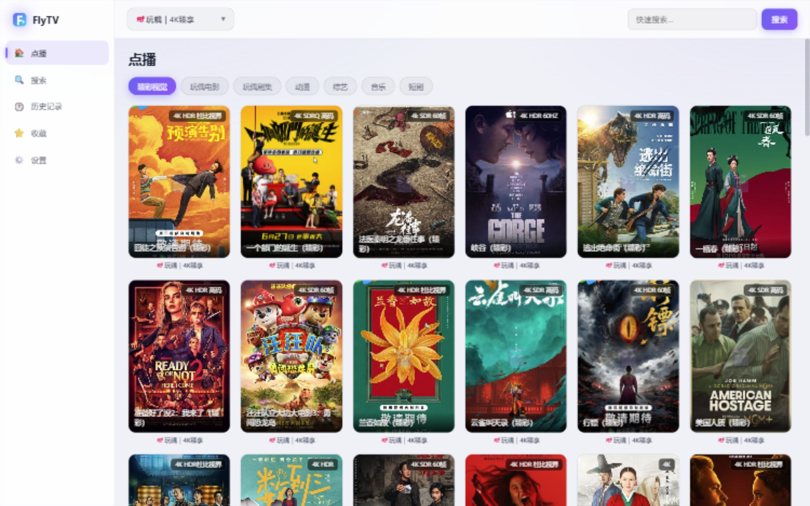

# FlyTV

> **TVBox 的桌面版 + 安卓版**：把 TVBox / CatVod 生态的 jar 爬虫与站点配置搬到 Windows，并用自建同步服务把两端打通——观看进度、网盘Key、收藏，实时互同步。

[](https://github.com/LanLanff/FlyTV/releases/latest)
[](LICENSE)
[](https://github.com/LanLanff/FlyTV/stargazers)



## 这是什么

FlyTV 把手机上 TVBox / CatVod 生态的 **jar 爬虫 + 站点配置** 原样搬到 Windows：

- **Windows 版**：纯 Java 引擎（自带精简 JRE，约 60MB，**无需安装 Java**）+ jar 爬虫宿主 + Web 界面（`http://127.0.0.1:9978/web`），鼠标、键盘、电视遥控都能用；
- **安卓版**：基于 TVBoxOSC 定制，内置同一套网盘与同步能力；
- **同步服务**：可选的单文件 Go 服务。两端扫同一个 `flytv://` 加密链接即可配对；数据用 AES-256-GCM 端到端加密后存进你自己的服务，不经过第三方。

## 功能

- **点播 / 直播 / 搜索**：兼容 TVBox 的 XML/JSON 源；全站式聚合搜索；支持拼音（`doupo`、`lldq`）
- **网盘播放**：夸克 / UC / 百度等登录（扫码或粘贴 Cookie）；夸克转存中继，高码率 / 4K 直出
- **跨端同步**：观看历史与进度、网盘 Key、收藏；WebSocket 实时推送（亚秒级），断线自动重连、长轮询兜底
- **播放器**：Plyr + hls.js；双击暂停、选集 / 上一集下一集、弹幕、倍速、画中画；断流自动重试；播放前预检登录状态
- **小窗预览**：详情页小播放器直接从上次进度续播；点一下无缝放大（同一媒体元素，不重新缓冲）
- **历史续播**：任意一端看过，换设备打开即从上次位置继续

## 快速开始

**Windows**：下载 `FlyTV-20260916.zip` → 解压 → 运行（首次启动拉起本地引擎）→ 浏览器打开 `http://127.0.0.1:9978/web`

**安卓**：安装 APK（`TVBox_debug-java64_builtin.apk`）

**同步（可选）**：服务器上运行 `flytv-sync` → 在两端填入同一个 `flytv://` 链接 → 自动开始同步

## 架构

```
FlyTV Windows   jre(精简) + flytv-engine.jar(Java 引擎) + web/(前端) + jar 爬虫宿主(9790)
FlyTV Android   TVBoxOSC 定制（Java 爬虫 + ExoPlayer + 弹幕）
flytv-sync      Go 单文件服务（26100）：加密云文件 + WebSocket 变更通知
```

## 引用的开源项目（致谢）

本项目站在这些优秀开源项目的肩膀上，特此致谢：

- **[TVBoxOSC](https://github.com/q215613905/TVBoxOSC)**（q215613905）—— 安卓端基础
- **[FongMi/TV](https://github.com/FongMi/TV)**（FongMi）—— 取值与实现思路参考
- **[Plyr](https://github.com/sampotts/plyr)** 与 **[hls.js](https://github.com/video-dev/hls.js)** —— 网页播放器与 HLS 播放
- **[OkHttp](https://github.com/square/okhttp)**、**[Gson](https://github.com/google/gson)**、**[jsoup](https://jsoup.org/)**、**[pinyin4j](https://github.com/belerweb/pinyin4j)**、**[BouncyCastle](https://www.bouncycastle.org/)** —— 桌面引擎依赖
- **[gorilla/websocket](https://github.com/gorilla/websocket)** —— 同步服务实时推送
- **[DanmakuFlameMaster](https://github.com/bilibili/DanmakuFlameMaster)**、**[ExoPlayer](https://github.com/androidx/media)** —— 安卓弹幕与播放
- 以及 TVBox 生态中的各类爬虫 jar（版权归各自作者）；各网盘接口为社区逆向成果

## 免责声明

本项目仅用于技术学习与个人自用，**不提供、不存储任何影视内容**；所有资源均来自第三方接口，请勿用于商业用途，并遵守当地法律法规。因使用本项目产生的一切后果由使用者自行承担。

## License

见 [LICENSE](LICENSE)。第三方组件遵循各自的开源协议。
