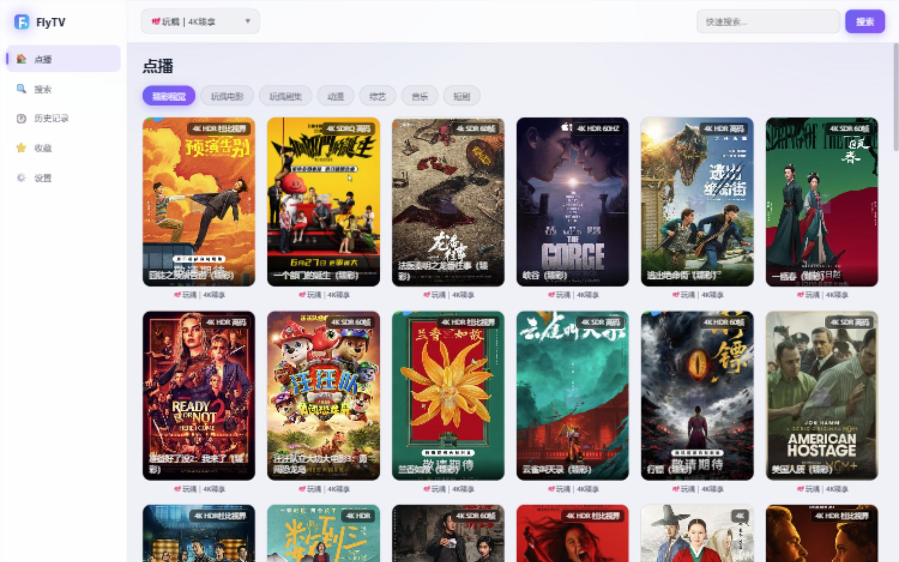

# FlyTV

> **把 TVBox 搬到电脑上**：Windows 端 = 纯 Java 引擎 + Web 界面（免安装、自带精简 JRE）；安卓端与桌面端共用一套**自建同步服务**——观看进度、网盘 Key、收藏，两端实时互同步。

[](https://github.com/LanLanff/FlyTV/releases/latest)
[](LICENSE)
[](https://github.com/LanLanff/FlyTV/stargazers)



## 下载

全部版本见 **[Releases](https://github.com/LanLanff/FlyTV/releases/latest)**（App 内的「检查更新」也走这里）：

| 平台 | 文件 | 说明 |
|---|---|---|
| **Windows 10/11** | `FlyTV-*-win.zip` | 解压即用；**自带精简 JRE（约 60MB），无需安装 Java** |
| **Android（arm64）** | `FlyTV-*-android-arm64.apk` | 直接安装；兼容 TVBox 的 jar 爬虫与站点配置 |
| **同步服务（可选）** | `flytv-sync` | 单文件 Go 服务；不部署也能单机使用 |

## 它能做什么

- **点播 / 直播 / 搜索**：兼容 TVBox 的 XML / JSON 源；全站式聚合搜索；支持拼音（`doupo`、`lldq`）
- **网盘播放**：夸克 / UC / 百度等登录（扫码或粘贴 Cookie）；夸克转存中继，高码率 / 4K 直出
- **跨端同步**（可选）：观看历史与进度、网盘 Key、收藏；WebSocket 实时推送（亚秒级），断线自动重连、长轮询兜底
- **播放器**：Plyr + hls.js；选集 / 上一集下一集 / 倍速 / 画中画 / 弹幕；双击暂停；全屏为整页全屏（选集、弹幕都在屏内）；断流自动重试；播放前预检登录状态
- **历史续播**：任意一端看过，换设备打开即从上次位置继续
- **小窗预览**：详情页小播放器直接从上次进度续播，点一下无缝放大

## 快速开始

**Windows**：下载 `FlyTV-*-win.zip` → 解压 → 运行 → 浏览器打开 `http://127.0.0.1:9978/web`

**Android**：安装 APK → 授权后即可使用

**同步（可选）**：在服务器上运行 `flytv-sync` → 两端填入同一个 `flytv://` 链接 → 自动开始同步；不配置则各自独立使用，互不影响

## 常见问题

- **要装 Java 吗？** 不用。Windows 包自带精简 JRE。
- **必须自己搭服务器吗？** 不必。单机完全可用；同步是可选功能，只在你配置后才联服务器。
- **网盘 Key / 登录怎么弄？** App 里「设置 → 网盘登录」，扫码或粘贴 Cookie；夸克推荐扫码。
- **手机和电脑的进度怎么同步？** 部署 `flytv-sync`，两端扫同一个 `flytv://` 链接；不部署就各自独立记录。
- **更新从哪来？** GitHub Release 附件（App 内「检查更新」自动获取）。
- **内置源？** 仓库不内置任何源；在配置里填写你自己的 TVBox 源地址即可。

## 架构

```
FlyTV Windows   jre(精简) + flytv-engine.jar(Java 引擎) + web/(前端) + jar 爬虫宿主(9790)
FlyTV Android   TVBoxOSC 定制（Java 爬虫 + ExoPlayer + 弹幕）
flytv-sync      Go 单文件服务（26100）：加密云文件 + WebSocket 变更通知
```

## 引用的开源项目（致谢）

本项目站在这些优秀开源项目的肩膀上，特此致谢：

- **[TVBoxOSC](https://github.com/q215613905/TVBoxOSC)**（q215613905）—— 安卓端基础
- **[FongMi/TV](https://github.com/FongMi/TV)**（FongMi）—— 取值与实现思路参考
- **[Plyr](https://github.com/sampotts/plyr)** 与 **[hls.js](https://github.com/video-dev/hls.js)** —— 网页播放器与 HLS 播放
- **[OkHttp](https://github.com/square/okhttp)**、**[Gson](https://github.com/google/gson)**、**[jsoup](https://jsoup.org/)**、**[pinyin4j](https://github.com/belerweb/pinyin4j)**、**[BouncyCastle](https://www.bouncycastle.org/)** —— 桌面引擎依赖
- **[gorilla/websocket](https://github.com/gorilla/websocket)** —— 同步服务的实时推送
- **[DanmakuFlameMaster](https://github.com/bilibili/DanmakuFlameMaster)**、**[ExoPlayer](https://github.com/androidx/media)** —— 安卓弹幕与播放
- 以及 TVBox 生态中的各类爬虫 jar（版权归各自作者）；各网盘接口为社区逆向成果

## 免责声明

本项目仅用于技术学习与个人自用，**不提供、不存储任何影视内容**；所有资源均来自第三方接口，请勿用于商业用途，并遵守当地法律法规。因使用本项目产生的一切后果由使用者自行承担。

## License

见 [LICENSE](LICENSE)。第三方组件遵循各自的开源协议。
